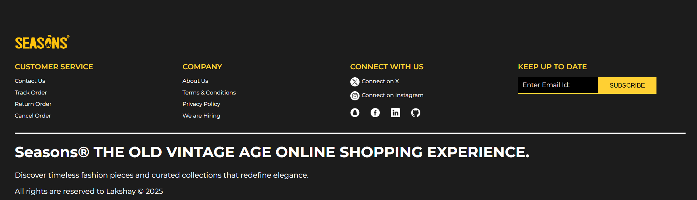
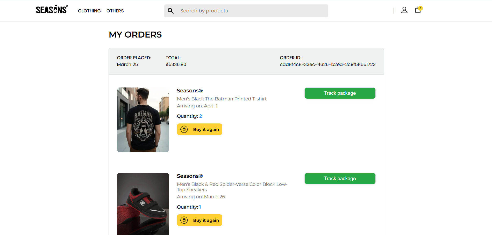
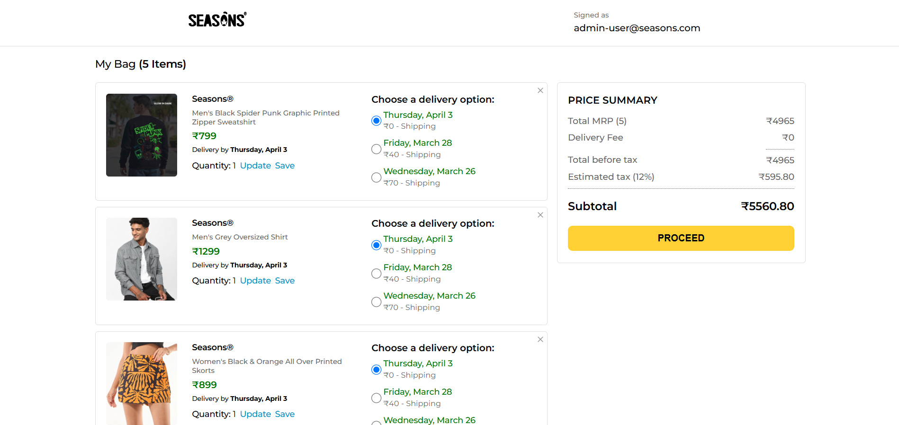

# 🛒 Seasons E-Commerce Website

This is a simple e-commerce website built using **HTML, CSS, and JavaScript**. It includes multiple pages for shopping, order tracking, and checkout.

## 🚀 Features

- 🏠 **Home Page** - Displays product listings.


- 📦 **Orders Page** - Shows order history.

- 🛍️ **Checkout Page** - Allows users to complete their purchase.

- 🚚 **Tracking Page** - Provides order tracking functionality.

- 📄 **Product Data** - Fetched from a **GitHub Gist JSON file**.
<!-- 
## 📂 Project Structure -->

## ⚙️ Technologies Used

- **Frontend**: HTML, CSS, JavaScript  
- **Data Source**: JSON file stored in **GitHub Gists**  
- **Version Control**: Git & GitHub  

## 📦 Installation & Usage

1. Clone the repository:
   ```bash
   git clone https://github.com/your-username/ecommerce-project.git

2. Open home.html in a browser.

3. Modify product data from your JSON Gist as needed.

## 📜 JSON Data (Products)

 - Products are stored in a GitHub Gist JSON file and fetched dynamically.

   Example structure:
    [
        {
            "id": "a434b69f-1bc1-482d-9ce7-cd7f4a66ce8d",
            "image": "images/product-images/men-s-brown-minion-badge-graphic-printed-oversized-t-shirt-596526-1742219511-1.webp",
            "rating": {
                    "stars": 4.5,
                    "count": 130
            },
            "name": "Men's Brown Minion Badge Graphic Printed Oversized T-shirt",
            "price": 569,
            "keywords": [
                    "Men",
                    "Minion",
                    "Oversized",
                    "t-shirt",
                    "Printed",
                    "Graphic"
            ]
        }
    ]

## 🎯 Future Improvements:

🔹 Add authentication & user login

🔹 Create my own Backend:
    1. Order.js
    - need to create the backend for order.js
    - which should be done in payment syummary

🔹 Integrate payment gateway

©2025 lakshay. All rights reserved.